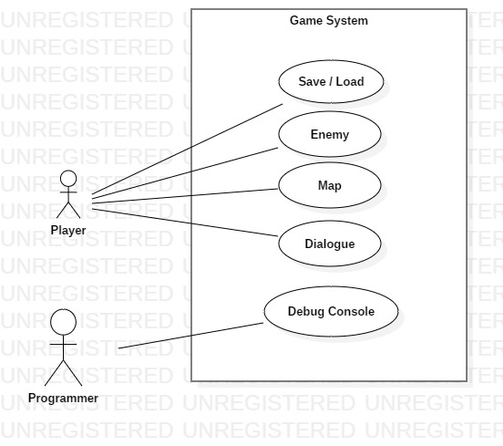
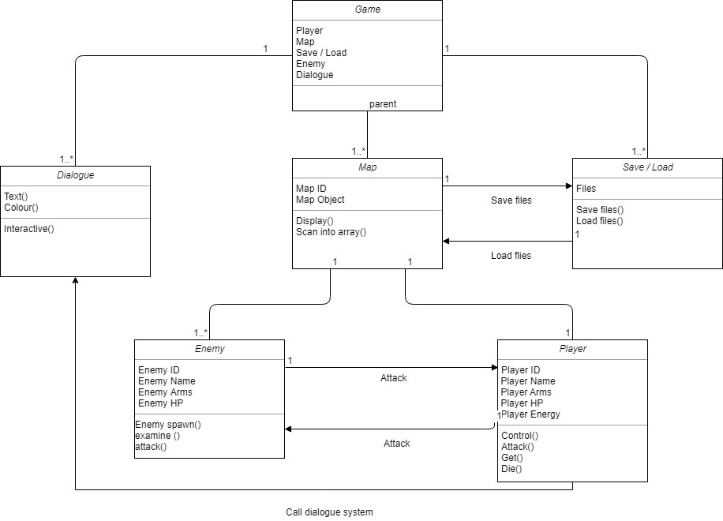
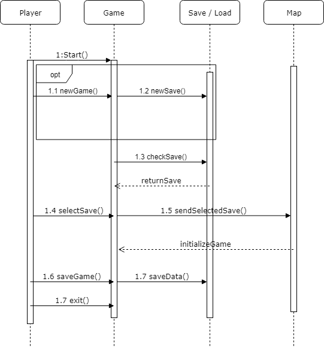

## 專題題目

2D平台遊戲 - 以化學和解謎為主軸，遊戲元素包含了跑酷及戰鬥等。

## 專題需求

1. 開場動畫
2. 主選單
3. 道具系統
4. 設定選單
5. 對話系統
6. 存檔系統
7. 關卡設計

## 功能性與非功能性需求

* ### 功能性需求

```
存檔
道具使用
按鍵設定
角色對話
戰鬥系統
陷阱機關
怪物
```

* ### 非功能性需求

```
存檔加密
載入速度優化
```
# Use case diagram



# 使用案例重要性排序

1. Map
2. Enemy
3. Save / Load
4. Dialogue
5. Debug console

# 至少三個使用案例

1. Map
2. Enemy
3. Save / Load

# User Story

* 身為一個{{玩家}}，我希望遊戲要有{{存檔功能}}，讓我能夠{{存檔}}不用每次重來。

* 身為一個{{玩家}}，我希望遊戲有{{敵人}}，能夠讓我跟他{{戰鬥}}。

* 身為一個{{玩家}}，我希望遊戲有{{地圖}}，能夠容納我的{{角色}}，讓他跑跑跳跳。

* 身為一個{{遊戲開發者}}，我希望遊戲裡能有{{除錯視窗}}，讓我便於{{偵錯}}。

# 初步類別圖


# 系統循序圖

